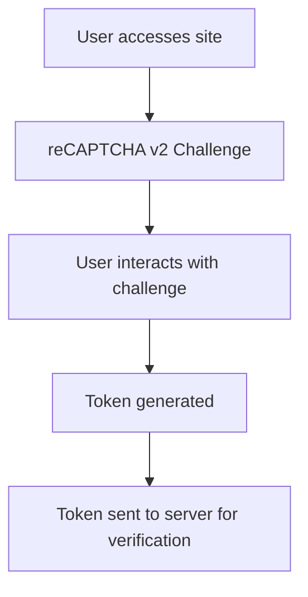
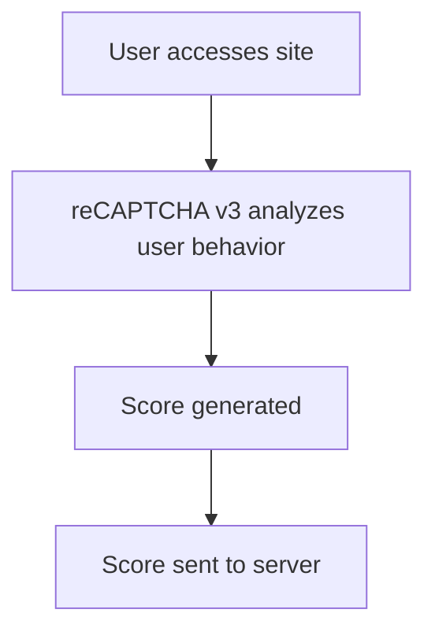

# Google reCAPTCHA Integration in ASP.NET

This project showcases the integration of Google reCAPTCHA in an ASP.NET application. It demonstrates the handling of both reCAPTCHA v2 and v3, and the differences between the Enterprise and Regular editions.

## What is CAPTCHA?

CAPTCHA (Completely Automated Public Turing test to tell Computers and Humans Apart) is a system designed to establish whether the user is a human or a robot. It protects websites from bots by generating and grading tests that humans can pass but current computer programs cannot.

## reCAPTCHA v2 vs v3

### reCAPTCHA v2
- Presents a checkbox for users to click.
- Might further challenge users with image-based questions.
- Returns a binary "pass" or "fail" result.

### reCAPTCHA v3
- Invisible to users (no direct interaction required).
- Assesses user interactions and returns a risk score.
- Lets you decide what to do with that score (e.g., challenge, block, pass).

## reCAPTCHA Enterprise vs Regular

### Enterprise
- Designed for businesses.
- Offers advanced security and flexibility.
- Verification URL follows the pattern: `parent/{PROJECT_ID}`

### Regular
- Free for use.
- Verification URL: `https://www.google.com/recaptcha/api/siteverify`

## Limitations:

1. **Rate Limits**: Google reCAPTCHA has rate limits. If you're testing extensively in a short amount of time, you might hit these limits.
2. **Supported Browsers**: Ensure that the browsers you're targeting are supported by Google reCAPTCHA.
3. **JavaScript Requirement**: reCAPTCHA requires JavaScript to be enabled. Users with JavaScript turned off won't be able to pass the reCAPTCHA check.
4. **Network Restrictions**: Some countries or corporate networks might block Google services, making reCAPTCHA unavailable.
5. **UI Customization**: The look and feel of the reCAPTCHA widget (especially v2) is mostly consistent and doesn't allow for extensive customization.

## Official Documentation:

- [reCAPTCHA v2 and v3](https://developers.google.com/recaptcha/intro)
- [reCAPTCHA Enterprise](https://cloud.google.com/recaptcha-enterprise/docs)

## Setup & Usage

1. Clone the repository.
2. Configure your reCAPTCHA keys in `appsettings.json` or through user secrets.
3. Run the application.
4. Navigate to the main page to test reCAPTCHA integration.
